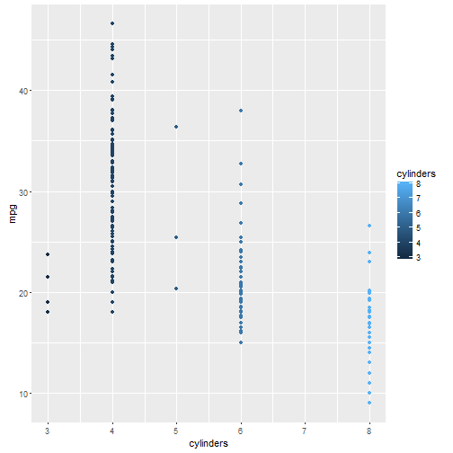

## Introduction

1. First Slides on Slidify
2. Written using R Markdown
3. For Course Project!


--- .class #id 

## Slide 2

Data Used: Auto Data from ISLR dataset

A Brief View on the Data

This dataset was taken from the StatLib library which is maintained at Carnegie Mellon University. The dataset was used in the 1983 American Statistical Association Exposition.

A data frame with 392 observations on the following 9 variables.

```r
library(slidify)
library(knitr)
library(ggplot2)
library(ISLR)
data(Auto)
```


--- 
## Slide 3: About the Data


```r
names(Auto)
```

```
## [1] "mpg"          "cylinders"    "displacement" "horsepower"  
## [5] "weight"       "acceleration" "year"         "origin"      
## [9] "name"
```
mpg - miles per gallon

cylinders - Number of cylinders between 4 and 8

displacement - Engine displacement (cu. inches)

horsepower - Engine horsepower

weight - Vehicle weight (lbs.)

acceleration - Time to accelerate from 0 to 60 mph (sec.)

year - Model year (modulo 100)

origin - Origin of car (1. American, 2. European, 3. Japanese)

name - Vehicle name

---
## Slide 4: Intent

Here, we are just building a small app on Shiny to visualize the relationships between different variables in the Auto data. 
We have created three variables for input - X variable, Y variable and C variable. These represent the X- axis, Y- axis and Color inputs for the output.
Sample:


---
## Slide 5 : Fifth Slide

As can be seen different variables can be selected and these determine the plots. 

Thank You!

